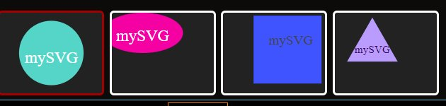

# SVG_developer

## Description

This is an SVG developer. You input what letters you want in a shape.

## Final Product

## Credits

Melisha Evans

## Technology

This was created with Javascript, node. 

## License

MIT License

## Acceptance Criteria

* GIVEN a command-line application that accepts user input
* WHEN I am prompted for text
* THEN I can enter up to three characters
* WHEN I am prompted for the text color
* THEN I can enter a color keyword (OR a hexadecimal number)
* WHEN I am prompted for a shape
* THEN I am presented with a list of shapes to choose from: circle, triangle, and square
* WHEN I am prompted for the shape's color
* THEN I can enter a color keyword (OR a hexadecimal number)
* WHEN I have entered input for all the prompts
* THEN an SVG file is created named `NEW-IMG.svg`
* AND the output text "Your NEW-IMG.svg is now available!!!" is printed in the command line
* WHEN I open the `NEW-IMG.svg` file in a browser
* THEN I am shown a 300x200 pixel image that matches the criteria I entered
